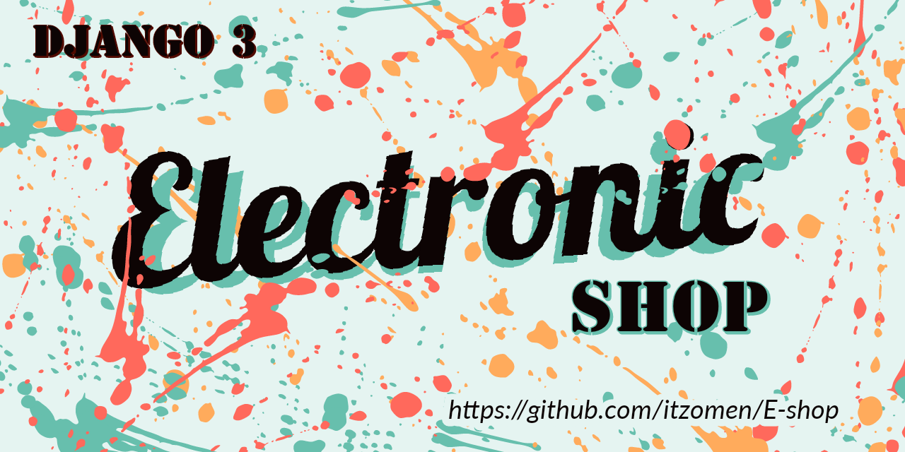

# E-shop

## [Preview E-shop](https://itzomen.pythonanywhere.com)

# Set up
Steps:

1. Clone/pull/download this repository
2. Create a virtualenv with `python -m venv env`
3. Activate virtual environment `source env/bin/activate`
4. Install dependencies with `pip install -r requirements.txt`

### Create superuser
`python manage.py createsuper`

### Finally runserver
`python manage.py runserver`

